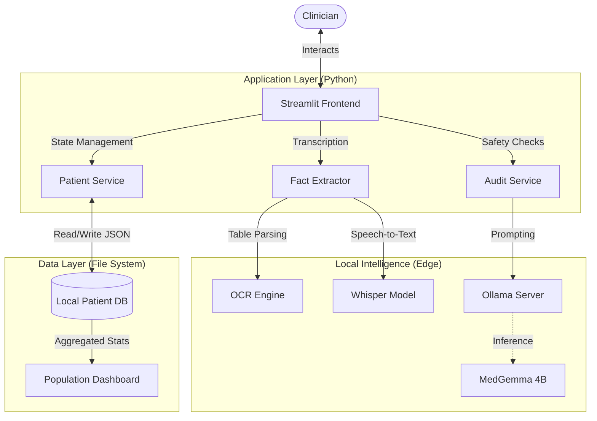

# SentinelMD 🛡️

**The Offline Clinical Safety Copilot**

> *"Turning Chaos into Safety."*

SentinelMD is an offline-first "Edge AI" copilot for clinicians. It acts as a second pair of eyes, automatically cross-referencing clinical notes, medication lists, and lab results to detect life-threatening errors—like drug interactions and allergy conflicts—without a single byte of data leaving the device.

---

## 🚀 Key Features

### 1. **Real-Time Safety Audit** 🧠
Powered by **MedGemma-2-9b (Quantized)** running locally.
*   **Instant Risk Analysis:** Flags drug-drug interactions, drug-lab conflicts, and allergy mismatches.
*   **Evidence Grounding:** Every alert is backed by "Evidence Quotes" from the patient record to prevent hallucinations.
*   **Sequential Progress:** Live feedback on validation, DDI checks, and LLM analysis.

### 2. **Voice-to-Chart Dictation** 🎙️
*   **Offline Speech Recognition:** Uses **Whisper Large-v3** (via Apple MLX or Faster-Whisper) to transcribe clinical dictation instantly.
*   **Auto-Structuring:** Automatically extracts and structures unstructured voice notes into **Clinical Note**, **Medications**, and **Labs** fields.

### 3. **Population Health Dashboard** 📊
*   **Clinic-Wide Intelligence:** Aggregates risk data across all patient records.
*   **Risk Stratification:** Visualizes high-risk patients and common safety concerns (e.g., "Hyperkalemia Clusters").
*   **Offline Analytics:** All dashboards are generated locally from file-system data.

### 4. **Multimodal Ingestion** 📄
*   **Universal Upload:** Drag & Drop PDFs, Images (Scanned Labs), or Text files.
*   **On-Device OCR:** Digitizes paper records instantly using Tesseract.

---

## 🏗️ Architecture

SentinelMD follows a **Local-First, Service-Oriented Architecture**:



*   **Frontend**: Streamlit
*   **Core Logic**: Python Services (`PatientService`, `AuditService`, `FactExtractor`)
*   **Inference**: Ollama (Client-Server)
*   **Models**: MedGemma (Reasoning), Whisper (Audio)
*   **Storage**: JSON-based local file system (No SQL database required)

---

## 🛠️ Getting Started

### Prerequisites
1.  **Python 3.10+**
2.  **Ollama**: Install from [ollama.com](https://ollama.com).
3.  **Tesseract OCR**:
    *   Mac: `brew install tesseract`
    *   Linux: `sudo apt-get install tesseract-ocr`

### Installation
1.  **Clone the repo**:
    ```bash
    git clone https://github.com/Magma4/sentinel.git
    cd sentinel
    ```

2.  **Install Dependencies**:
    ```bash
    python -m venv .venv
    source .venv/bin/activate
    pip install -r requirements.txt
    ```

3.  **Pull the Model**:
    ```bash
    ollama pull amsaravi/medgemma-4b-it:q6
    ```

4.  **Run the App**:
    ```bash
    streamlit run src/app/ui_streamlit.py
    ```

---

## ⚠️ Disclaimer
**SentinelMD is a clinical decision support tool, NOT a diagnostic device.**
It is designed to identify potential documentation errors and safety risks for human review. It does not replace professional medical judgment.
