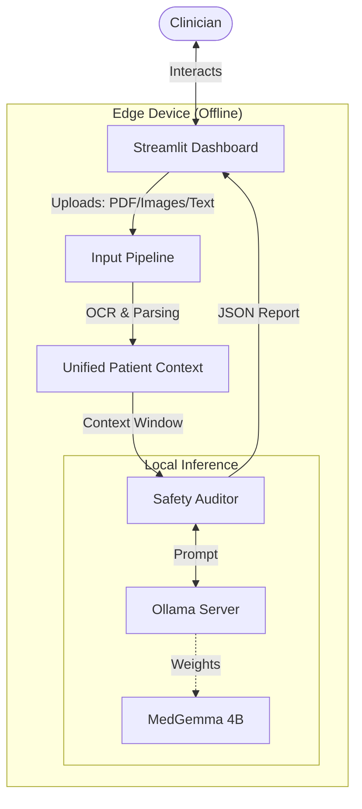

# SentinelMD 🛡️

**The Offline Clinical Safety Copilot**

> *"Turning Chaos into Safety."*

SentinelMD is an offline-first "Edge AI" application that acts as a second pair of eyes for clinicians. It automatically cross-references clinical notes, scanned medication lists, and lab results to detect life-threatening errors like drug-drug interactions and missing workflow steps—all without requiring an internet connection.

---

## The Problem
In high-pressure clinical environments—especially in resource-constrained settings like rural areas—doctors are overwhelmed. Medical records are often fractured across handwritten scripts, PDFs, and printed lab results. In this chaos, subtle connections (like a patient on ACE inhibitors showing signs of hyperkalemia) can easily slip through the cracks. Cloud-based AI tools are often unusable due to poor connectivity or strict privacy regulations.

## The Solution
SentinelMD serves as an intelligent, local auditor.
*   **Offline Inference**: Powered by **MedGemma** running locally via Ollama.
*   **Zero Data Exfiltration**: Patient data never leaves the device.
*   **Multimodal**: Reads PDFs, Images (via OCR), and structured text.

## Key Features
1.  **Automated Safety Review**: Instantly flags HIGH/MEDIUM risks (e.g., Allergies, Med-Lab Conflicts).
2.  **Strict Grounding**: Every flag provides "Evidence Quotes" from the source document to prevent hallucinations.
3.  **Interactive Safety Assistant**: A Chatbot that lets clinicians ask follow-up questions (e.g., *"Why is this lab value concerning?"*) and get evidence-backed answers.

---

## Getting Started

### Prerequisites
1.  **Python 3.10+**
2.  **Ollama**: Install from [ollama.com](https://ollama.com).
3.  **MedGemma Model**: Pull the model:
    ```bash
    ollama pull amsaravi/medgemma-4b-it:q6
    ```

### Installation
1.  **Clone the repo**:
    ```bash
    git clone https://github.com/Magma4/sentinel.git
    cd sentinel
    ```

2.  **Set up environment**:
    ```bash
    python -m venv .venv
    source .venv/bin/activate
    pip install -r requirements.txt
    ```

3.  **Run the App**:
    ```bash
    streamlit run src/app/ui_streamlit.py
    ```

### Remote / Cloud Deployment
To deploy the frontend to Streamlit Cloud while keeping the model local (for security or hardware reasons), use **ngrok**.
See full instructions in [DEPLOYMENT.md](DEPLOYMENT.md).

---

## Architecture



*   **Frontend**: Streamlit (Python)
*   **Inference**: Ollama (Local)
*   **Model**: MedGemma (4B Quantized)
*   **OCR**: Tesseract & PyPDF

## Disclaimer
**SentinelMD is a safety checking tool, NOT a diagnostic device.** It does not recommend treatments or diagnoses. It is designed to catch workflow errors and documentation inconsistencies. User judgment is always required.
